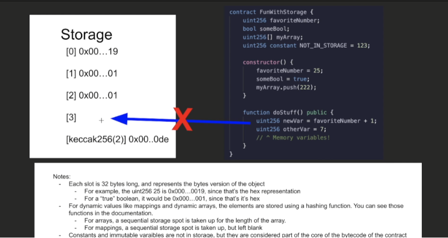
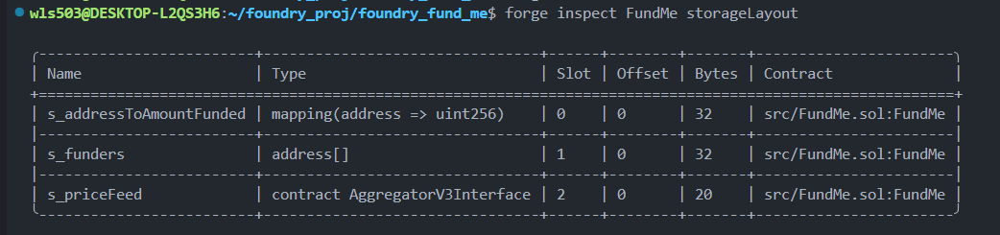
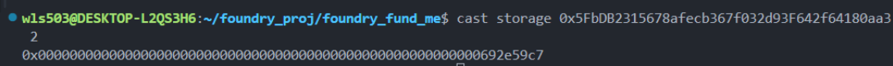
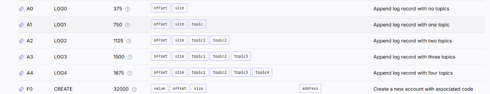
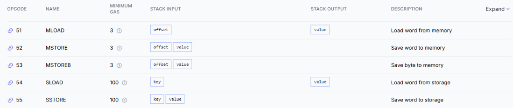
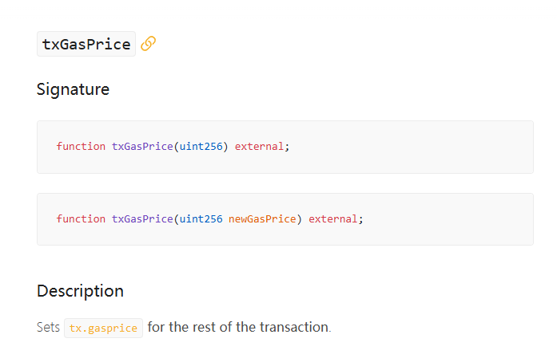

# Gas Optimization Techniques in Solidity

## Understanding Storage Costs

Storage operations are the most expensive operations in the EVM. Understanding how storage works is crucial for writing gas-efficient smart contracts.

### Storage Layout Basics

Think of storage as a massive array of slots, where:

-   Each slot is numbered: [0], [1], [2]...
-   Each slot holds 32 bytes (256 bits)
-   State variables are assigned slots sequentially

```solidity
contract Example {
    uint256 favoriteNumber;  // slot [0]
    bool someBool;          // slot [1]
    uint256[] myArray;      // slot [2] stores length only
}
```



### Key Storage Principles

1. **Simple variables** (uint256, bool) are stored directly in sequential slots
2. **Dynamic arrays** store their length in the assigned slot, while actual data is stored at `keccak256(slot_number)`
3. **Constant and immutable variables** don't use storage slots - they're part of the contract bytecode
4. **Function-local variables** use memory, not storage



### Inspecting Storage

You can check storage contents using Foundry's `cast storage` command:

```bash
cast storage <CONTRACT_ADDRESS> <SLOT_NUMBER>
```



## Gas Costs by Operation Type

Not all operations cost the same amount of gas. According to [evm.codes](https://www.evm.codes/):

### High-Cost Operations (100+ gas):

-   **SLOAD** (storage read): 100-2100 gas
-   **SSTORE** (storage write): 2900-20000 gas
-   Account creation, logging operations



### Low-Cost Operations (3-10 gas):

-   **MLOAD/MSTORE** (memory operations): 3-6 gas
-   Basic arithmetic operations



**Key Takeaway**: Reading/writing storage is 30-100x more expensive than memory operations!

## Practical Gas Optimization: The `cheaperWithdraw()` Example

### The Problem

The original `withdraw()` function reads from storage in every loop iteration:

```solidity
function withdraw() public onlyOwner {
    for (uint256 i = 0; i < s_funders.length; i++) {  // ❌ Reads storage every iteration
        address funder = s_funders[i];
        s_addressToAmountFunded[funder] = 0;
    }
    // ... rest of function
}
```

Every time the loop checks `i < s_funders.length`, it performs an expensive **SLOAD** operation.

### The Solution

Cache the storage variable in memory before the loop:

```solidity
function cheaperWithdraw() public onlyOwner {
    uint256 fundersLength = s_funders.length;  // ✅ Read storage ONCE
    for (uint256 i = 0; i < fundersLength; i++) {  // Use memory variable
        address funder = s_funders[i];
        s_addressToAmountFunded[funder] = 0;
    }
    // ... rest of function
}
```

### Measuring Gas Savings

Use Foundry's gas snapshot feature to compare:

```bash
forge snapshot --match-test testWithdrawFromMultipleFunders
```

This creates a `.gas-snapshot` file showing exact gas consumption:


**Result**: Significant gas savings with just one line change!

### Advanced Gas Measurement in Tests

You can measure gas usage in your tests using Foundry's built-in functions:

```solidity
uint256 gasStart = gasleft();  // Gas before operation
vm.txGasPrice(GAS_PRICE);      // Set gas price for testing

fundMe.withdraw();             // Execute operation

uint256 gasEnd = gasleft();    // Gas after operation
uint256 gasUsed = (gasStart - gasEnd) * tx.gasprice;
console.log(gasUsed);
```



## Best Practices Summary

1. ✅ **Cache storage variables** in memory when used multiple times
2. ✅ **Use `constant` and `immutable`** for values that don't change
3. ✅ **Minimize storage writes** - they're the most expensive operations
4. ✅ **Use memory for temporary data** in functions
5. ✅ **Measure gas usage** with `forge snapshot` to validate optimizations

## Additional Resources

-   [Solidity Storage Layout Documentation](https://docs.soliditylang.org/en/v0.8.30/internals/layout_in_storage.html)
-   [EVM Opcodes Gas Costs](https://www.evm.codes/)
-   [Foundry Gas Snapshots](https://book.getfoundry.sh/forge/gas-snapshots)

---

Remember: Every storage read/write costs real money when deployed to mainnet. Small optimizations like caching storage variables can save thousands of dollars in gas fees over a contract's lifetime!
