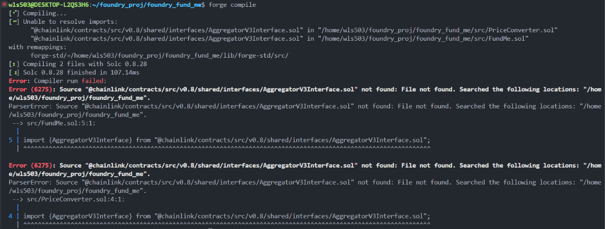
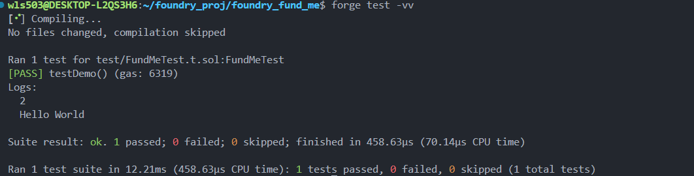
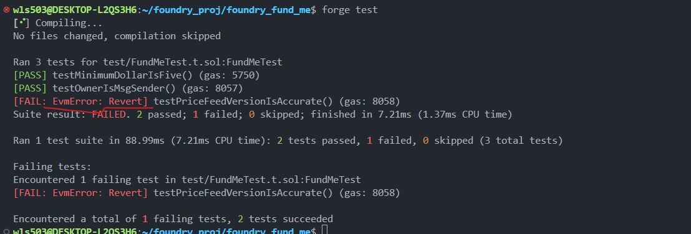
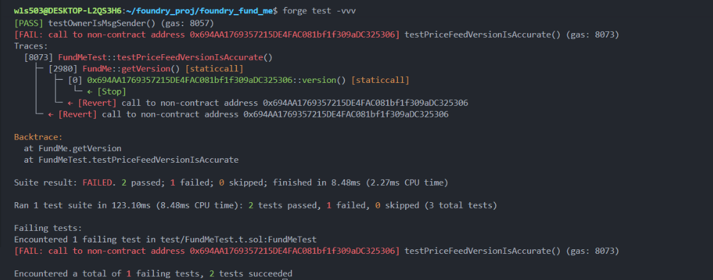
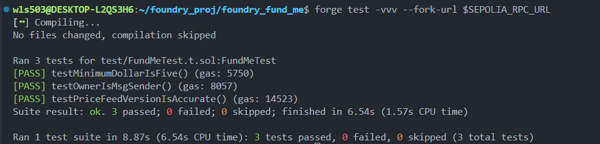

# Foundry FundMe Development Guide

## 1. Project Initialization

```bash
mkdir foundry_fund_me && cd foundry_fund_me
forge init
forge test  # Verify default project works
```

Delete Foundry's auto-generated files:

```bash
rm src/*.sol script/*.sol test/*.sol
```

## 2. Create Contracts

Create **FundMe.sol** and **PriceConverter.sol** in `src/` directory.

## 3. Solve Compilation Errors

Run `forge compile` and you'll encounter import errors:



**Solution**: Install Chainlink dependencies

```bash
forge install smartcontractkit/chainlink-brownie-contracts@1.3.0
```

The missing file path:

```
lib/chainlink-brownie-contracts/contracts/src/v0.8/shared/interfaces/AggregatorV3Interface.sol
```

**Configure remappings** in `foundry.toml`:

```toml
remappings = ["@chainlink/contracts/=lib/chainlink-brownie-contracts/contracts/"]
```

Now `forge compile` should pass.

## 4. Importance of Testing

> **Key Points**:
>
> -   Deploying smart contracts without tests will be rejected in audits
> -   No tests = immature code
> -   Writing excellent tests differentiates great developers from mediocre ones

## 5. Write Tests

Create **FundMeTest.t.sol** in `test/`:

```solidity
// SPDX-License-Identifier: MIT
pragma solidity ^0.8.18;

import {Test, console} from "forge-std/Test.sol";
import {FundMe} from "../src/FundMe.sol";

contract FundMeTest is Test {
    FundMe fundMe;

    function setUp() external {
        fundMe = new FundMe();
    }

    function testMinimumDollarIsFive() public {
        assertEq(fundMe.MINIMUM_USD(), 5e18);
    }

    function testOwnerIsMsgSender() public {
        assertEq(fundMe.i_owner(), address(this));
    }

    function testPriceFeedVersionIsAccurate() public {
        uint256 version = fundMe.getVersion();
        assertEq(version, 4);
    }
}
```

Run tests with visibility flag:

```bash
forge test -vv
```



## 6. Understanding EVM Revert Error

The `testPriceFeedVersionIsAccurate()` test fails:



Check details with `-vvv`:



**Root Cause**: When running `forge test` without specifying an RPC URL, Foundry spins up a temporary blank Anvil chain and deletes it after testing. The hardcoded Chainlink price feed address doesn't exist on this blank chain.

**Solution**: Fork a real network

Create `.env`:

```bash
SEPOLIA_RPC_URL=https://eth-sepolia.g.alchemy.com/v2/YOUR_API_KEY
```

Load and run:

```bash
source .env
forge test -vvv --fork-url $SEPOLIA_RPC_URL
```

Test now passes:



## 7. Four Types of Tests

-   **Unit**: Testing a specific part of code
-   **Integration**: Testing how code works with other parts
-   **Forked**: Testing code on a simulated real environment
-   **Staging**: Testing code in a real environment (not production)
