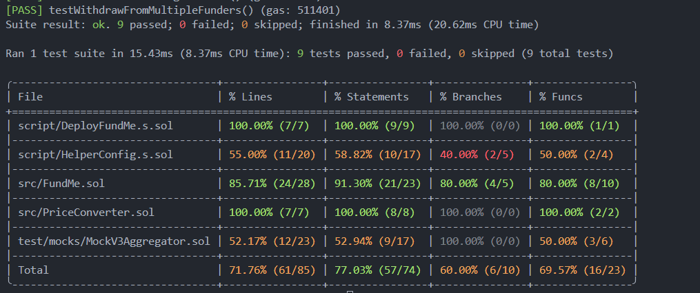

# Foundry FundMe Development Guide

## 1. Project Initialization

```bash
mkdir foundry_fund_me && cd foundry_fund_me
forge init
forge test  # Verify default project works
rm src/*.sol script/*.sol test/*.sol  # Clean auto-generated files
```

## 2. Create Contracts

Create **FundMe.sol** and **PriceConverter.sol** in `src/` directory.

## 3. Solve Compilation Errors

Run `forge compile` and you'll encounter import errors.

**Solution**: Install Chainlink dependencies

```bash
forge install smartcontractkit/chainlink-brownie-contracts@1.3.0
```

**Configure remappings** in `foundry.toml`:

```toml
remappings = ["@chainlink/contracts/=lib/chainlink-brownie-contracts/contracts/"]
```

## 4. Importance of Testing

> **Key Points**: Deploying smart contracts without tests will be rejected in audits. Writing excellent tests differentiates great developers from mediocre ones.

## 5. Write Tests

Create **FundMeTest.t.sol** in `test/`. Run tests:

```bash
forge test -vv
```

## 6. Understanding EVM Revert Error

The `testPriceFeedVersionIsAccurate()` test fails with EVM revert.

**Root Cause**: Foundry spins up a blank Anvil chain for testing. The hardcoded Chainlink price feed address doesn't exist on this blank chain.

**Solution**: Fork a real network

```bash
# Create .env
SEPOLIA_RPC_URL=https://eth-sepolia.g.alchemy.com/v2/YOUR_API_KEY

# Run tests
source .env
forge test -vvv --fork-url $SEPOLIA_RPC_URL
```

## 7. Four Types of Tests

-   **Unit**: Testing a specific part of code
-   **Integration**: Testing how code works with other parts
-   **Forked**: Testing code on a simulated real environment
-   **Staging**: Testing code in a real environment (not production)

## 8. Making Contracts Modular and Chain-Agnostic

### Problem

The initial implementation hardcodes the Chainlink price feed address for Sepolia, preventing deployment to other networks.

### Solution

Refactor to accept the price feed address as a constructor parameter.

### Key Changes

#### 8.1 FundMe Contract

Add state variable and modify constructor:

```solidity
AggregatorV3Interface public s_priceFeed;

constructor(address priceFeed) {
    i_owner = msg.sender;
    s_priceFeed = AggregatorV3Interface(priceFeed);
}
```

Update functions to use `s_priceFeed`:

```solidity
function fund() public payable {
    require(msg.value.getConversionRate(s_priceFeed) >= MINIMUM_USD, "...");
    // ...
}

function getVersion() public view returns (uint256) {
    return s_priceFeed.version();
}
```

#### 8.2 PriceConverter Library

Pass price feed as parameter:

```solidity
function getPrice(AggregatorV3Interface priceFeed) internal view returns (uint256) {
    (, int256 answer, , , ) = priceFeed.latestRoundData();
    return uint256(answer * 10000000000);
}

function getConversionRate(uint256 ethAmount, AggregatorV3Interface priceFeed)
    internal view returns (uint256) {
    uint256 ethPrice = getPrice(priceFeed);
    // ...
}
```

#### 8.3 Deployment Script

Initially still hardcoded:

```solidity
function run() external returns (FundMe) {
    vm.startBroadcast();
    FundMe fundMe = new FundMe(0x694AA1769357215DE4FAC081bf1f309aDC325306);
    vm.stopBroadcast();
    return fundMe;
}
```

This accepts constructor parameters but the address is still hardcoded. We need a configuration management system.

#### 8.4 Test File Updates

Update `setUp()` to use deployment script:

```solidity
import {DeployFundMe} from "../script/DeployFundMe.s.sol";

function setUp() external {
    DeployFundMe deployFundMe = new DeployFundMe();
    fundMe = deployFundMe.run();
}
```

Update owner assertion:

```solidity
function testOwnerIsMsgSender() public {
    assertEq(fundMe.i_owner(), msg.sender);  // Changed from address(this)
}
```

## 9. Implementing HelperConfig for Multi-Chain Deployment

### The Problem

Even with constructor parameters, our deployment script still hardcodes addresses. We need automatic network detection.

### 9.1 Create HelperConfig

Create `script/HelperConfig.s.sol`:

```solidity
contract HelperConfig is Script {
    struct NetworkConfig {
        address priceFeed;
    }

    NetworkConfig public activeNetworkConfig;

    constructor() {
        if (block.chainid == 11155111) {
            activeNetworkConfig = getSepoliaEthConfig();
        } else if (block.chainid == 1) {
            activeNetworkConfig = getMainnetEthConfig();
        } else {
            activeNetworkConfig = getAnvilEthConfig();
        }
    }

    function getSepoliaEthConfig() public pure returns (NetworkConfig memory) {
        return NetworkConfig({
            priceFeed: 0x694AA1769357215DE4FAC081bf1f309aDC325306
        });
    }

    function getMainnetEthConfig() public pure returns (NetworkConfig memory) {
        return NetworkConfig({
            priceFeed: 0x5f4eC3Df9cbd43714FE2740f5E3616155c5b8419
        });
    }

    function getAnvilEthConfig() public pure returns (NetworkConfig memory) {
        return NetworkConfig({priceFeed: address(0)});  // Placeholder
    }
}
```

**Key Design Points:**

-   **Struct**: Groups network-specific addresses
-   **Auto-detection**: Uses `block.chainid` to determine network
-   **Public variable**: `activeNetworkConfig` gets auto-generated getter function

### 9.2 Update DeployFundMe

```solidity
import {HelperConfig} from "./HelperConfig.s.sol";

function run() external returns (FundMe) {
    // Before startBroadcast -> No gas cost
    HelperConfig helperConfig = new HelperConfig();
    address ethUsdPriceFeed = helperConfig.activeNetworkConfig();

    vm.startBroadcast();
    FundMe fundMe = new FundMe(ethUsdPriceFeed);
    vm.stopBroadcast();
    return fundMe;
}
```

### 9.3 Understanding Auto-Getter

When you declare:

```solidity
NetworkConfig public activeNetworkConfig;
```

Solidity auto-generates:

```solidity
function activeNetworkConfig() public view returns (NetworkConfig memory)
```

That's why you can call `helperConfig.activeNetworkConfig()` with parentheses.

**Note**: The code `address ethUsdPriceFeed = helperConfig.activeNetworkConfig();` works due to Solidity's implicit conversion when struct has one field. For clarity and future-proofing, using `.priceFeed` explicitly is recommended.

### 9.4 Deployment Examples

```bash
# Deploy to Sepolia - auto-detects chainid 11155111
forge script script/DeployFundMe.s.sol --rpc-url $SEPOLIA_RPC_URL --broadcast

# Deploy to Mainnet - auto-detects chainid 1
forge script script/DeployFundMe.s.sol --rpc-url $MAINNET_RPC_URL --broadcast

# Local tests - uses Anvil config
forge test
```

### Benefits

-   Zero manual configuration per deployment
-   Single source of truth for addresses
-   Easy to extend with new networks
-   Same script works across all environments

## 10. Mock Contracts for Local Testing

### The Problem

Running `forge test` locally fails because Anvil (local chain) doesn't have Chainlink contracts. We need mock contracts to simulate price feeds without forking testnets.

### 10.1 Create Mock Price Feed

Create `test/mocks/MockV3Aggregator.sol` - a simplified version of Chainlink's aggregator for testing.

### 10.2 Update HelperConfig

Import mock and add constants:

```solidity
import {MockV3Aggregator} from "../test/mocks/MockV3Aggregator.sol";

contract HelperConfig is Script {
    uint8 public constant DECIMALS = 8;
    int256 public constant INITIAL_PRICE = 2000e8;  // $2000 per ETH
```

Rename and implement `getOrCreateAnvilEthConfig()`:

```solidity
function getOrCreateAnvilEthConfig() public returns (NetworkConfig memory) {
    // Check if already deployed
    if (activeNetworkConfig.priceFeed != address(0)) {
        return activeNetworkConfig;
    }

    // Deploy mock
    vm.startBroadcast();
    MockV3Aggregator mockPriceFeed = new MockV3Aggregator(DECIMALS, INITIAL_PRICE);
    vm.stopBroadcast();

    return NetworkConfig({priceFeed: address(mockPriceFeed)});
}
```

**Key points:**

-   Check if mock already exists to avoid re-deployment
-   Use `vm.startBroadcast()` to deploy mock to Anvil
-   Returns mock address as price feed

### 10.3 Fix Version Test for Multiple Networks

Update test to handle different networks:

```solidity
function testPriceFeedVersionIsAccurate() public {
    uint256 version = fundMe.getVersion();

    if (block.chainid == 11155111) {
        assertEq(version, 4);  // Sepolia
    } else if (block.chainid == 1) {
        assertEq(version, 6);  // Mainnet
    } else {
        assertTrue(version > 0);  // Anvil mock
    }
}
```

## 11. Writing Comprehensive Tests

### 11.1 Improve Contract Testability

**Make state variables private** and add getter functions:

```solidity
// Before: public (exposes internal state)
mapping(address => uint256) public addressToAmountFunded;
address[] public funders;

// After: private with getters (better encapsulation)
mapping(address => uint256) private s_addressToAmountFunded;
address[] private s_funders;
AggregatorV3Interface private s_priceFeed;

function getAddressToAmountFunded(address fundingAddress) external view returns (uint256) {
    return s_addressToAmountFunded[fundingAddress];
}

function getFunder(uint256 index) external view returns (address) {
    return s_funders[index];
}

function getOwner() external view returns (address) {
    return i_owner;
}
```

**Why this matters:**

-   **Encapsulation**: Internal implementation details are hidden
-   **Flexibility**: Can change internal structure without breaking tests
-   **Security**: Prevents unintended external access to state

### 11.2 Setup Test Infrastructure

```solidity
contract FundMeTest is Test {
    FundMe fundMe;

    address USER = makeAddr("user");  // Create test address
    uint256 constant SEND_VALUE = 0.1 ether;
    uint256 constant STARTING_BALANCE = 10 ether;

    function setUp() external {
        DeployFundMe deployFundMe = new DeployFundMe();
        fundMe = deployFundMe.run();
        vm.deal(USER, STARTING_BALANCE);  // Give USER test ETH
    }
}
```

### 11.3 Basic Fund Function Tests

**Test insufficient ETH revert:**

```solidity
function testFundFailsWithoutEnoughETH() public {
    vm.expectRevert();  // Expect next line to revert
    fundMe.fund();  // Send 0 ETH, should fail
}
```

**Test fund updates data structure:**

```solidity
function testFundUpdatesFundedDataStructure() public {
    vm.prank(USER);  // Next tx sent by USER
    fundMe.fund{value: SEND_VALUE}();

    uint256 amountFunded = fundMe.getAddressToAmountFunded(USER);
    assertEq(amountFunded, SEND_VALUE);
}
```

**Test funder array tracking:**

```solidity
function testAddsFunderToArrayOfFunders() public {
    vm.prank(USER);
    fundMe.fund{value: SEND_VALUE}();

    address funder = fundMe.getFunder(0);
    assertEq(funder, USER);
}
```

### 11.4 Using Test Modifiers for Code Reuse

Create a `funded` modifier to avoid repeating setup code:

```solidity
modifier funded() {
    vm.prank(USER);
    fundMe.fund{value: SEND_VALUE}();
    _;  // Execute test function body here
}
```

**Usage:**

```solidity
function testOnlyOwnerCanWithdraw() public funded {
    vm.expectRevert();
    vm.prank(USER);
    fundMe.withdraw();  // USER is not owner, should revert
}
```

**Benefits:**

-   **DRY principle**: Don't Repeat Yourself
-   **Clearer intent**: Test name focuses on what's being tested
-   **Easier maintenance**: Change funding logic in one place

### 11.5 Testing Withdraw Functionality

**Test single funder withdrawal:**

```solidity
function testWithDrawWithASingleFunder() public funded {
    // Arrange: Record balances before withdrawal
    uint256 startingOwnerBalance = fundMe.getOwner().balance;
    uint256 startingFundMeBalance = address(fundMe).balance;

    // Act: Owner withdraws
    vm.prank(fundMe.getOwner());
    fundMe.withdraw();

    // Assert: Verify balance changes
    uint256 endingOwnerBalance = fundMe.getOwner().balance;
    uint256 endingFundMeBalance = address(fundMe).balance;

    assertEq(endingFundMeBalance, 0);  // Contract should be empty
    assertEq(
        startingFundMeBalance + startingOwnerBalance,
        endingOwnerBalance
    );  // Owner should receive all funds
}
```

**Test multiple funders withdrawal:**

```solidity
function testWithdrawFromMultipleFunders() public funded {
    // Arrange: Create multiple funders
    uint160 numberOfFunders = 10;
    uint160 startingFunderIndex = 1;  // Skip address(0)

    for (uint160 i = startingFunderIndex; i < numberOfFunders; i++) {
        // hoax = vm.prank + vm.deal combined
        hoax(address(i), SEND_VALUE);
        fundMe.fund{value: SEND_VALUE}();
    }

    uint256 startingOwnerBalance = fundMe.getOwner().balance;
    uint256 startingFundMeBalance = address(fundMe).balance;

    // Act: Owner withdraws all funds
    vm.startPrank(fundMe.getOwner());
    fundMe.withdraw();
    vm.stopPrank();

    // Assert: Verify complete withdrawal
    assertEq(address(fundMe).balance, 0);
    assertEq(
        startingFundMeBalance + startingOwnerBalance,
        fundMe.getOwner().balance
    );
}
```

**Why use `uint160` for addresses:**

-   Addresses in Solidity are 20 bytes = 160 bits
-   Using `uint160` allows safe conversion: `address(i)`
-   Using `uint256` could cause overflow when converting to address

**Why skip `address(0)`:**

-   `address(0)` is often reserved/restricted in smart contracts
-   Many contracts revert on operations with zero address
-   Starting from `address(1)` avoids potential issues

### 11.6 Advanced Cheat Codes

**`hoax(address, amount)`:**

-   Combines `vm.prank()` and `vm.deal()` in one call
-   Sets up a prank from an address that has ETH
-   Perfect for testing multiple users funding

```solidity
// Instead of:
vm.deal(address(1), SEND_VALUE);
vm.prank(address(1));
fundMe.fund{value: SEND_VALUE}();

// Use:
hoax(address(1), SEND_VALUE);
fundMe.fund{value: SEND_VALUE}();
```

### 11.7 Test Coverage Improvement

**Initial Coverage** (5 tests):


-   FundMe.sol: 42.31% lines, 36.36% statements

**Improved Coverage** (9 tests):



-   FundMe.sol: **85.71% lines**, **91.30% statements** ✅
-   Significant improvement in core contract testing
-   Main untested areas: Error handling edge cases

**Run coverage analysis:**

```bash
forge coverage
```

### 11.8 Complete Test Suite Summary

**All Tests:**

```bash
forge test -vv
```

Output:

```
[PASS] testFundFailsWithoutEnoughETH() (gas: 25125)
[PASS] testFundUpdatesFundedDataStructure() (gas: 102514)
[PASS] testAddsFunderToArrayOfFunders() (gas: 102789)
[PASS] testOnlyOwnerCanWithdraw() (gas: 105234)
[PASS] testWithDrawWithASingleFunder() (gas: 108567)
[PASS] testWithdrawFromMultipleFunders() (gas: 511401)
[PASS] testMinimumDollarIsFive() (gas: 5750)
[PASS] testOwnerIsMsgSender() (gas: 8101)
[PASS] testPriceFeedVersionIsAccurate() (gas: 11369)

Suite result: ok. 9 passed; 0 failed; 0 skipped
```

### 11.9 Key Testing Patterns Learned

**Arrange-Act-Assert (AAA) Pattern:**

```solidity
function testExample() public {
    // Arrange: Set up test conditions
    uint256 startingBalance = address(fundMe).balance;

    // Act: Execute the function being tested
    fundMe.withdraw();

    // Assert: Verify expected outcomes
    assertEq(address(fundMe).balance, 0);
}
```

**Test Modifiers for Setup:**

-   Use modifiers to reduce boilerplate
-   Makes test intent clearer
-   Easier to maintain

**Cheat Codes Used:**

-   `makeAddr("name")`: Create labeled test address
-   `vm.deal(address, amount)`: Give address ETH
-   `vm.prank(address)`: Next call sent by address
-   `vm.startPrank(address)` / `vm.stopPrank()`: Multiple calls as address
-   `vm.expectRevert()`: Expect next call to fail
-   `hoax(address, amount)`: Prank + deal combined

**Best Practices:**

1. Test one thing per test function
2. Use descriptive test names (test + what it does)
3. Always test failure cases (reverts)
4. Verify state changes with assertions
5. Aim for high coverage but focus on critical paths

---

## Summary

You now have a complete, production-ready FundMe contract with:

-   ✅ Multi-chain deployment support
-   ✅ Mock contracts for local testing
-   ✅ Comprehensive test suite (85%+ coverage)
-   ✅ Modular, maintainable code structure
-   ✅ Professional testing patterns
