# Deploying Foundry Lottery Contract to Sepolia Testnet

This guide walks you through deploying a lottery smart contract to the Sepolia testnet using Foundry, and integrating it with Chainlink VRF (Verifiable Random Function) and Automation services.

## Overview

The lottery contract demonstrates a decentralized raffle system that:

-   Accepts entries from participants
-   Uses Chainlink VRF for provably fair random winner selection
-   Utilizes Chainlink Automation for periodic automated draws
-   Runs entirely on-chain without manual intervention

## Prerequisites

-   Foundry installed
-   MetaMask wallet with Sepolia ETH
-   Etherscan API key
-   Sepolia RPC URL

## Project Setup

### Creating the Makefile

First, create a `Makefile` in your project root to manage common tasks:

```makefile
-include .env

.PHONY: all test deploy

build :; forge build

test :
    forge test

coverage :
    forge coverage

install :; forge install cyfrin/foundry-devops@0.4.0 && \
    forge install smartcontractkit/chainlink-brownie-contracts@1.3.0 && \
    forge install foundry-rs/forge-std@v1.9.6 && forge install transmission11/solmate@v6

deploy-sepolia :; forge script script/DeployRaffle.s.sol:DeployRaffle \
    --rpc-url $(SEPOLIA_RPC_URL) \
    --account myAccount --broadcast --verify --etherscan-api-key $(ETHERSCAN_API_KEY) -vvvv
```

This Makefile includes commands for:

-   **build**: Compiling the smart contracts
-   **test**: Running unit and integration tests
-   **coverage**: Checking code coverage
-   **install**: Installing required dependencies
-   **deploy-sepolia**: Deploying to Sepolia testnet

## Deploying to Sepolia Testnet

Run the deployment command:

```bash
make deploy-sepolia
```

The deployment process will compile your contract and deploy it to Sepolia:

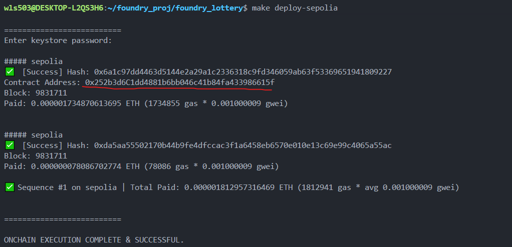

**Note**: Due to network conditions, the automatic verification may fail initially. Don't worry - we'll verify the contract manually in a later step.

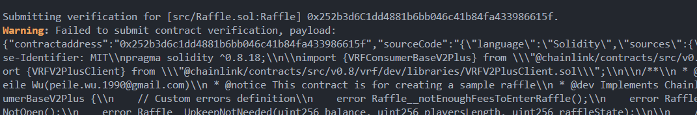

## Chainlink VRF Integration

### Why Use Chainlink VRF?

Chainlink VRF (Verifiable Random Function) provides cryptographically secure randomness for blockchain applications. For a lottery contract, this is critical because:

-   **Provably Fair**: The randomness is verifiable on-chain, ensuring no one can manipulate the winner selection
-   **Tamper-Proof**: Neither the contract owner, participants, nor miners can predict or influence the random number
-   **Transparent**: All randomness requests and their results are recorded on-chain

Without VRF, lottery contracts would be vulnerable to manipulation, as standard pseudo-random functions can be predicted or influenced by miners.

### Setting Up VRF Subscription

1. Visit the Chainlink VRF documentation: [https://docs.chain.link/vrf/v2-5/getting-started](https://docs.chain.link/vrf/v2-5/getting-started)

2. Click on the Subscription Manager link to access [https://vrf.chain.link/](https://vrf.chain.link/)

3. Click **"Create Subscription"** button and connect your MetaMask wallet

4. After creating the subscription, add funds (either Sepolia LINK or ETH tokens)

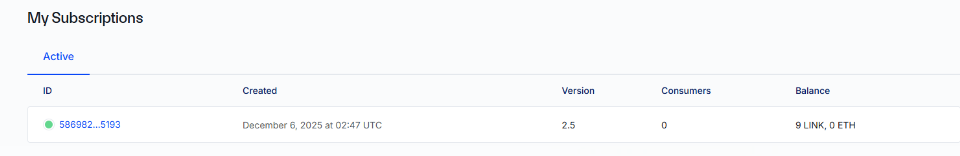

1. The contract deployment script automatically adds your lottery contract as a consumer. After deployment, you'll see the consumer address (which matches your deployed contract address):

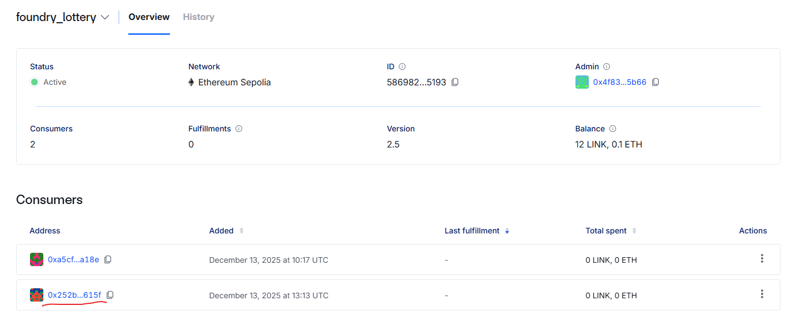

## Chainlink Automation Setup

### Why Use Chainlink Automation?

Chainlink Automation (formerly Keepers) enables smart contracts to execute functions automatically at specified intervals or under certain conditions. For our lottery:

-   **Periodic Draws**: Automatically triggers the winner selection at regular intervals
-   **Decentralized Execution**: No need for centralized servers or manual intervention
-   **Reliable**: Chainlink's decentralized network ensures consistent execution
-   **Cost-Effective**: Only pays for execution when conditions are met

Without automation, someone would need to manually trigger each lottery draw, creating a centralized point of failure.

### Registering Automation Upkeep

1. Visit the Chainlink Automation page: [https://automation.chain.link/](https://automation.chain.link/)

2. Click **"Register new Upkeep"**

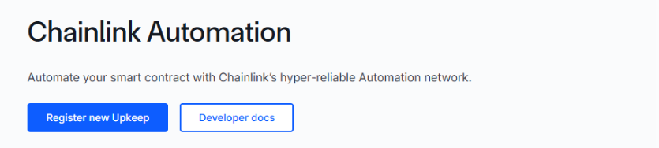

1. Select **"Custom logic"** trigger type

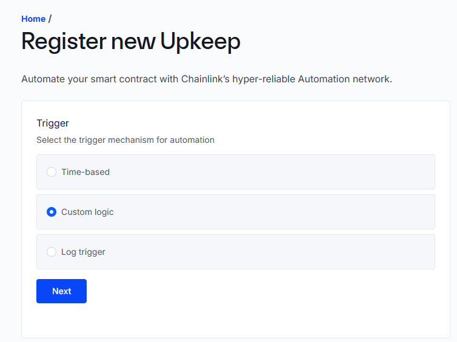

1. Enter your deployed contract address

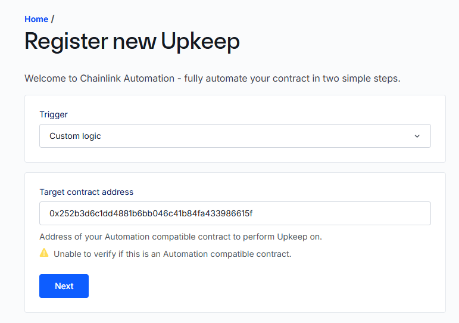

1. Provide a name for your Upkeep and set the initial funding balance. Sign the transaction with your wallet to complete registration.

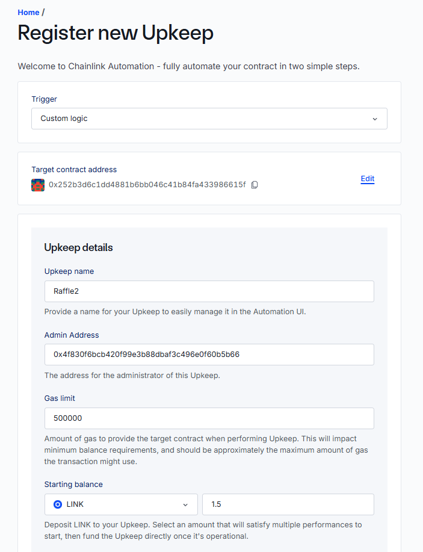

1. After registration, you can view your Upkeep details on the dashboard

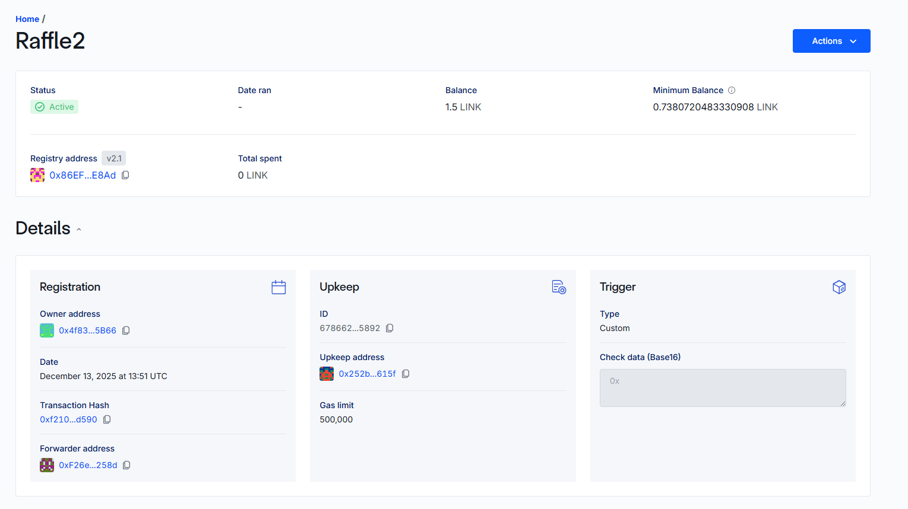

## Manual Contract Verification

Since automatic verification may fail during deployment, we'll verify the contract manually using the Standard JSON Input format.

### Generate Verification JSON

Run the following command to generate a verification JSON file:

```bash
forge verify-contract 0x252b3d6C1dd4881b6bb046c41b84fa433986615f \
    src/Raffle.sol:Raffle \
    --etherscan-api-key $ETHERSCAN_API_KEY \
    --rpc-url $SEPOLIA_RPC_URL \
    --show-standard-json-input > contract_verify.json
```

Replace `0x252b3d6C1dd4881b6bb046c41b84fa433986615f` with your actual deployed contract address.

### Upload to Etherscan

1. Go to your contract on Sepolia Etherscan
2. Click **"Verify and Publish"**
3. Fill in the contract details and select "Solidity (Standard-Json-Input)" as the verification method
4. Upload the generated `contract_verify.json` file

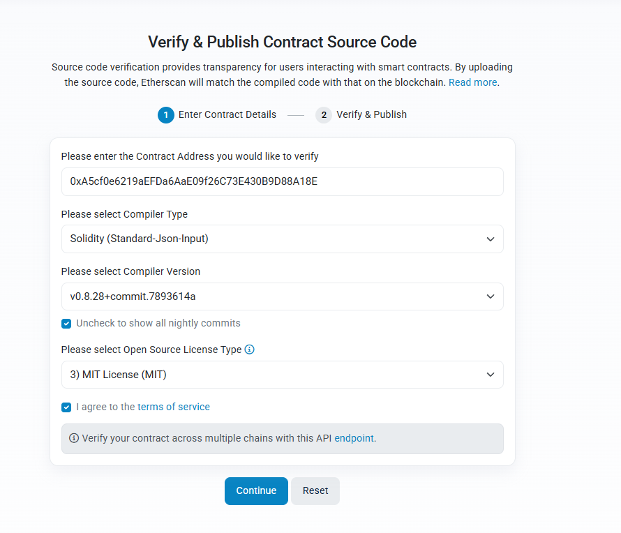

### Verification Success

Once the verification completes, your contract will be verified and publicly viewable:

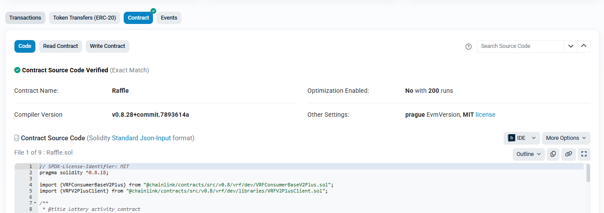

## Summary

You've successfully:

1. ✅ Deployed a lottery contract to Sepolia testnet
2. ✅ Integrated Chainlink VRF for secure random number generation
3. ✅ Set up Chainlink Automation for periodic draws
4. ✅ Verified the contract on Etherscan

Your lottery contract is now fully operational on the Sepolia testnet with:

-   Provably fair winner selection via Chainlink VRF
-   Automated periodic draws via Chainlink Automation
-   Transparent, verifiable code on Etherscan

Users can now participate in the lottery, and the system will automatically select winners at the configured intervals without any manual intervention.
