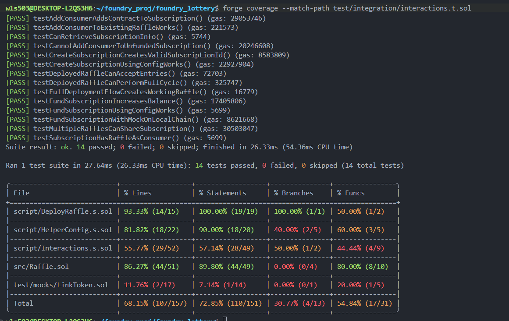
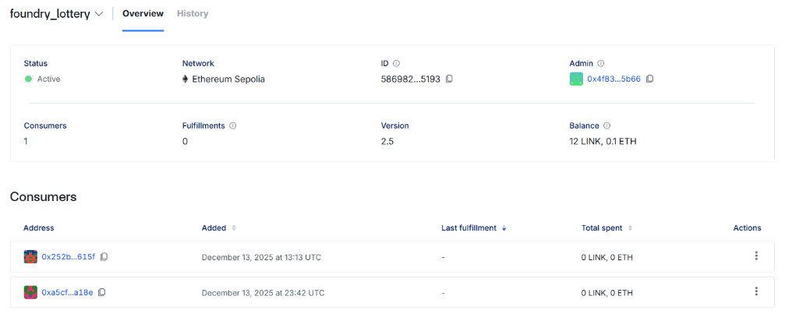
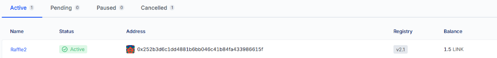
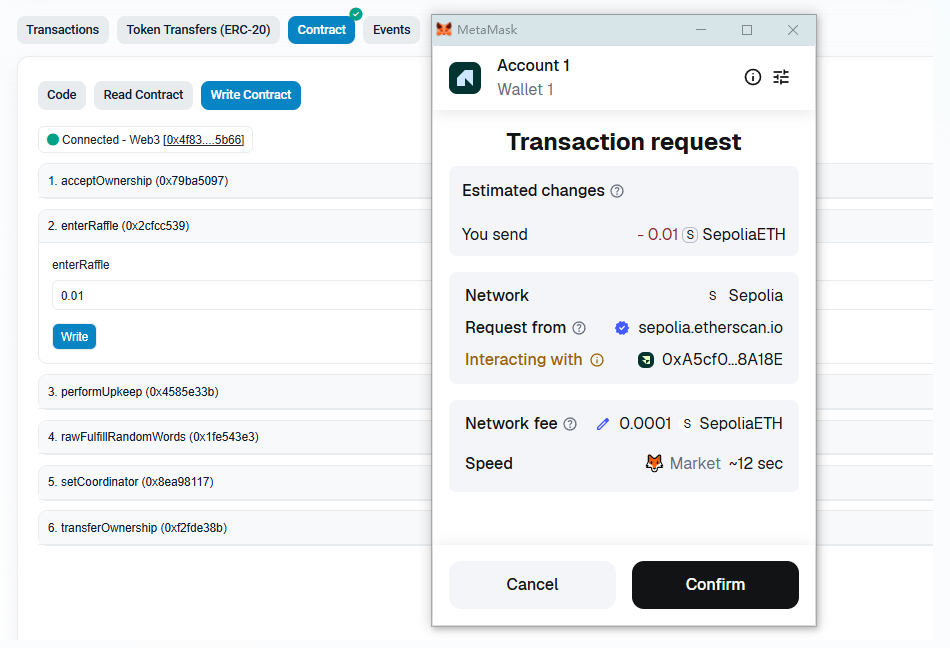
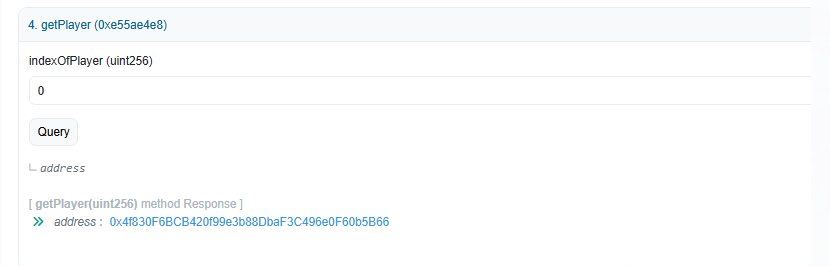
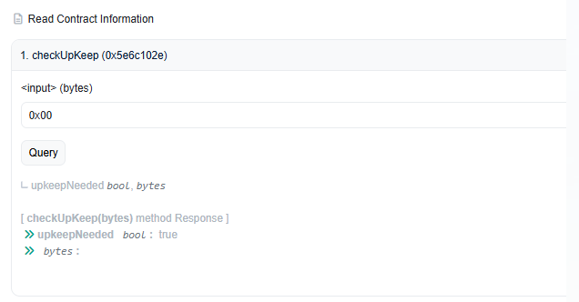
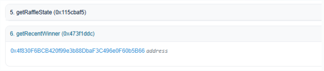

# Foundry Lottery - Decentralized Raffle System

A fully automated, provably fair lottery system built on blockchain technology. This project demonstrates how smart contracts can create transparent, trustless raffles that run themselves without human intervention.

## 🎯 What Does This Project Do?

Think of this as a digital raffle where:

-   Anyone can buy a ticket by paying a small entry fee (0.01 ETH)
-   The system automatically picks a winner at regular intervals
-   The winner gets all the money collected from ticket sales
-   Everything happens automatically - no person controls the outcome
-   All transactions are transparent and verifiable on the blockchain

## 🎲 How It Works (Simple Explanation)

1. **Buy a Ticket**: You send 0.01 ETH to enter the raffle
2. **Wait for Draw**: The system waits for the timer and checks if there are enough players
3. **Random Winner Selection**: When conditions are met, the system automatically requests a random number from Chainlink
4. **Winner Gets Paid**: The random number picks a winner, and they receive all the ETH in the prize pool
5. **New Round Starts**: The raffle resets and starts accepting entries again

## 🔧 Technology Behind the Scenes

### Foundry Framework

This project is built with **Foundry** - a modern development toolkit for Ethereum applications:

-   **Lightning Fast**: Compiles and tests contracts 10x faster than traditional tools
-   **Solidity Testing**: Write tests in Solidity, not JavaScript
-   **Developer Friendly**: Quick iteration and excellent debugging tools

**Foundry's Powerful Testing Suite**:

Foundry provides multiple testing approaches to ensure contract reliability:

1. **Unit Testing** - Tests individual functions in isolation

    - Verifies each function works correctly on its own
    - Fast execution for rapid development
    - Example: Testing if `enterRaffle()` reverts when payment is too low

2. **Integration Testing** - Tests how components work together

    - Validates deployment scripts and full workflows
    - Ensures VRF subscription creation, funding, and consumer registration work end-to-end
    - Example: Testing the complete raffle cycle from entry to winner selection

3. **Fuzz Testing** - Automatically generates random inputs to find edge cases

    - Runs tests with hundreds of random values (default: 256 runs)
    - Discovers bugs that manual testing might miss
    - Example: Testing `fulfillRandomWords()` with 1024 different random request IDs

4. **Fork Testing** - Tests against real blockchain state
    - Simulates deployment on actual networks (like Sepolia)
    - Validates contract behavior with real VRF and Automation services
    - Catches network-specific issues before production deployment

**Test Coverage Results**:

Our comprehensive testing strategy achieves solid coverage across all contract components:



-   ✅ **14 integration tests** - All passing
-   ✅ **12 unit tests** - All passing
-   ✅ **68.15% line coverage** - Core logic thoroughly tested
-   ✅ **Fuzz testing** - 1024+ random inputs tested
-   ✅ **Fork testing** - Validated on Sepolia testnet

The combination of these testing methods ensures the raffle system is robust, secure, and production-ready.

### Chainlink VRF (Random Number Generator)

**Problem**: Computers can't generate truly random numbers, especially on blockchain where everything must be predictable and verifiable.

**Solution**: [Chainlink VRF](https://docs.chain.link/vrf) provides cryptographically secure random numbers:

-   Generates randomness off-chain with mathematical proof
-   No one can predict or manipulate the outcome
-   The random number is verifiable - anyone can check it's fair

**How it works**:

1. The contract requests a random number
2. Chainlink generates it with cryptographic proof
3. The random number is delivered back to select the winner

### Chainlink Automation (Auto-Pilot for Smart Contracts)

**Problem**: Smart contracts can't run on their own - they need someone to trigger them.

**Solution**: [Chainlink Automation](https://automation.chain.link/) monitors and triggers your contract automatically:

-   Continuously checks if conditions are met (time passed, players entered, etc.)
-   Automatically calls the contract when it's time to pick a winner
-   No manual intervention needed - the raffle runs 24/7

## 💰 Understanding the Two Balances

### VRF Subscription Balance

This pays for random number generation.



-   **Current Balance**: 12 LINK + 0.1 ETH
-   **Used For**: Paying Chainlink to generate random numbers
-   **When Consumed**: Every time a winner is selected
-   **Who Uses It**: All contracts connected to this subscription (currently 2 consumers)

### Upkeep Balance

This pays for automatic execution.



-   **Current Balance**: 1.5 LINK
-   **Used For**: Paying Chainlink Automation to monitor and trigger the raffle
-   **When Consumed**: Every time Automation calls `performUpkeep` to start winner selection
-   **Who Uses It**: Only this specific raffle contract

## 🎮 Live Demo Walkthrough

### Step 1: Enter the Raffle

Connect your wallet and call `enterRaffle` with 0.01 ETH to buy a ticket.



### Step 2: Check Your Entry

Call `getPlayer` with index 0 to see the first player's address (the 1st one).



### Step 3: Check if Ready for Draw

Call `checkUpKeep` - if it returns `true`, the raffle is ready to pick a winner.



What `true` means:

-   ✅ Enough time has passed
-   ✅ There are players in the raffle
-   ✅ The contract has balance
-   ✅ The raffle is open (not currently selecting a winner)

### Step 4: Winner Announcement

After Chainlink Automation triggers the draw, call `getRecentWinner` to see who won!



Congratulations to the winner! 🎉

## 🚀 Quick Start

### Prerequisites

-   [Foundry](https://book.getfoundry.sh/getting-started/installation) installed
-   MetaMask wallet with Sepolia testnet ETH
-   Basic understanding of blockchain (optional but helpful)

### Installation

```bash
# Clone the repository
git clone <repository-url>
cd foundry_lottery

# Install dependencies
forge install

# Build the project
forge build

# Run tests
forge test

# Run tests with detailed output
forge test -vvv
```

### Deploy to Sepolia Testnet

```bash
# Create .env file with your RPC URL
echo "SEPOLIA_RPC_URL=your_rpc_url_here" > .env

# Import your account
cast wallet import myAccount --interactive

# Deploy
make deploy-sepolia
```

### Post-Deployment Setup

1. **Add VRF Consumer**: Go to [vrf.chain.link](https://vrf.chain.link) and add your contract as a consumer
2. **Register Automation**: Go to [automation.chain.link](https://automation.chain.link) and register your contract
3. **Fund Both Services**: Add LINK tokens to VRF subscription and Automation upkeep

## 🔒 Security Features

-   **State Locking**: Prevents entries during winner selection
-   **CEI Pattern**: Protects against reentrancy attacks
-   **Custom Errors**: Gas-efficient error handling
-   **Automated Validation**: All conditions checked before execution

## 🎓 What You'll Learn

By exploring this project, you'll understand:

-   How to build smart contracts with Foundry
-   How to integrate Chainlink VRF for randomness
-   How to use Chainlink Automation for autonomous contracts
-   Best practices for smart contract security
-   Testing strategies for blockchain applications

## 📚 Documentation

-   [Technical Implementation Guide](docs/Technical_Implementation.md)
-   [Testing Documentation](docs/TestCase.md)
-   [Integration Testing Guide](docs/IntegrationTest.md)
-   [Deployment Guide](docs/deploy_toSepolia.md)

## 🤝 Contributing

Contributions are welcome! Feel free to open issues or submit pull requests.

## 📄 License

MIT License

## 👨‍💻 Author

**Peile Wu**  
Email: peile.wu.1990@gmail.com

## 🔗 Useful Resources

-   [Foundry Book](https://book.getfoundry.sh/) - Complete Foundry documentation
-   [Chainlink VRF](https://docs.chain.link/vrf) - Learn about verifiable randomness
-   [Chainlink Automation](https://docs.chain.link/chainlink-automation) - Understand smart contract automation
-   [Ethereum Smart Contracts](https://ethereum.org/en/developers/docs/smart-contracts/) - Introduction to smart contracts

---

**Note**: This project is for educational purposes. Always audit smart contracts before using them with real funds.
