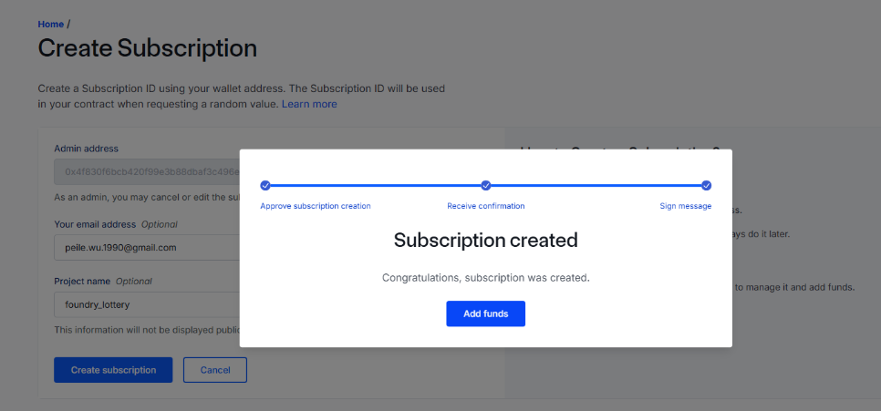
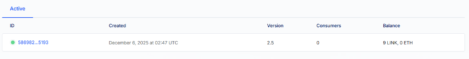
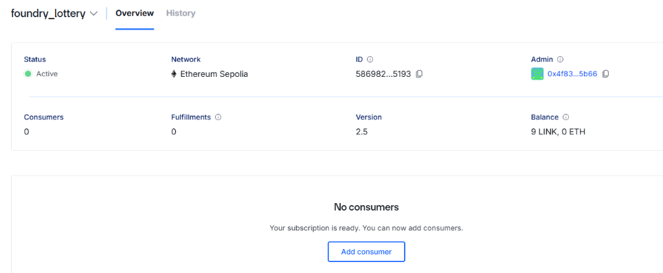
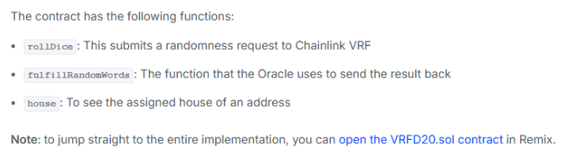

# Raffle Contract - Technical Documentation

## Overview

**Contract**: Raffle  
**Version**: 1.1 (VRF Integrated with State Management)  
**Solidity**: ^0.8.18  
**License**: MIT  
**Author**: Peile Wu (peile.wu.1990@gmail.com)

A decentralized lottery contract using Chainlink VRF 2.5 for provably fair random number generation, with complete state management and winner selection.

---

## Chainlink VRF Setup

### Creating a Subscription

Visit https://docs.chain.link/vrf/v2-5/getting-started and click the subscription manager link to access https://vrf.chain.link/

1. Click "Create Subscription" button
2. Connect MetaMask wallet
3. Complete the transaction to create subscription
4. Add funds (Sepolia LINK or ETH)



### Adding Funds

After creating the subscription, you can add funds using either:

-   Sepolia LINK tokens (recommended)
-   Sepolia ETH (native payment)

### Adding Consumer Contract

After deploying the Raffle contract, you need to add it as a consumer to your subscription.

Click on the subscription ID to open the consumer management interface:



This opens the Add Consumer interface where you can add your deployed contract address:



---

## Why Chainlink VRF?

### The Randomness Problem

Randomness is very difficult to generate on blockchains because:

-   Every node must reach the same conclusion (consensus)
-   All computations are deterministic and reproducible
-   Block data can be manipulated by miners
-   Random numbers cannot be generated natively in smart contracts

### The VRF Solution

**Chainlink VRF** (Verifiable Random Function) solves this by:

-   Generating randomness off-chain with cryptographic proof
-   Providing verifiable proof that randomness wasn't tampered with
-   Delivering the random number through oracle callback

> **Key Principle**: Randomness cannot be stored on-chain for reference. If stored, participants can retrieve and predict outcomes. Instead, randomness must be requested from an oracle, which generates a random number with cryptographic proof, then returns the result to the requesting contract.

---

## Contract Architecture

### Dependencies

```solidity
import {VRFConsumerBaseV2Plus} from "@chainlink/contracts/src/v0.8/vrf/dev/VRFConsumerBaseV2Plus.sol";
import {VRFV2PlusClient} from "@chainlink/contracts/src/v0.8/vrf/dev/libraries/VRFV2PlusClient.sol";
```

**Installation**:

```bash
# Install Chainlink contracts
git clone --depth 1 --branch v2.17.0 \
  https://github.com/smartcontractkit/chainlink.git \
  lib/chainlink
```

**Configuration** (`foundry.toml`):

```toml
[profile.default]
src = "src"
out = "out"
libs = ["lib"]
remappings = ["@chainlink/contracts/=lib/chainlink/contracts/"]
```

### Inheritance

```solidity
contract Raffle is VRFConsumerBaseV2Plus {
    // Implementation
}
```

The contract inherits from `VRFConsumerBaseV2Plus` to integrate Chainlink VRF functionality.

---

## State Variables

### Raffle State Management

```solidity
enum RaffleState {
    OPEN,         // Raffle is accepting entries
    CALCULATING   // Raffle is selecting winner (locked)
}

RaffleState private s_raffleState;
```

**Purpose**: Prevents users from entering while winner selection is in progress, avoiding race conditions and ensuring fair gameplay.

### Lottery Configuration

```solidity
uint256 private immutable i_entranceFee;  // Entry fee in wei
uint256 private immutable i_interval;     // Time between draws in seconds
```

### VRF Configuration

```solidity
bytes32 private immutable i_keyHash;           // Gas lane key hash
uint256 private immutable i_subscriptionId;    // VRF subscription ID
uint32 private immutable i_callbackGasLimit;   // Callback gas limit
uint16 private constant REQUEST_CONFIRMATIONS = 3;  // Block confirmations
uint32 private constant NUM_WORDS = 1;         // Number of random values
```

**Configuration Parameters** (Sepolia):

-   VRF Coordinator: `0x9DdfaCa8183c41ad55329BdeeD9F6A8d53168B1B`
-   Key Hash: `0x787d74caea10b2b357790d5b5247c2f63d1d91572a9846f780606e4d953677ae`
-   Callback Gas Limit: `100000` (recommended starting point)

### Runtime State

```solidity
address payable[] private s_players;       // Array of participants
uint256 private s_lastTimeStamp;           // Last drawing timestamp
address private s_recentWinner;            // Most recent winner address
```

---

## Custom Errors

```solidity
error Raffle__notEnoughFeesToEnterRaffle();  // Insufficient entry fee
error Raffle__TransferFailed();              // Prize transfer failed
error Raffle__RaffleNotOpen();               // Raffle is closed for entries
```

Custom errors provide gas-efficient error handling compared to `require` statements with string messages.

**Naming Convention**: `ContractName__ErrorDescription` (note the capital first letter)

---

## Constructor

```solidity
constructor(
    uint256 entranceFee,
    uint256 interval,
    address vrfCoordinator,
    bytes32 gasLane,
    uint256 subscriptionId,
    uint32 callbackGasLimit
) VRFConsumerBaseV2Plus(vrfCoordinator)
```

### Parameters

| Parameter          | Type    | Description                 | Example                        |
| ------------------ | ------- | --------------------------- | ------------------------------ |
| `entranceFee`      | uint256 | Entry fee in wei            | `10000000000000000` (0.01 ETH) |
| `interval`         | uint256 | Drawing interval in seconds | `86400` (24 hours)             |
| `vrfCoordinator`   | address | VRF Coordinator address     | `0x9DdfaCa8...`                |
| `gasLane`          | bytes32 | Gas lane key hash           | `0x787d74...`                  |
| `subscriptionId`   | uint256 | Your VRF subscription ID    | From VRF UI                    |
| `callbackGasLimit` | uint32  | Max gas for callback        | `100000`                       |

### Initialization

The constructor now properly initializes:

-   All immutable VRF parameters
-   `s_lastTimeStamp` to current block timestamp
-   `s_raffleState` to `OPEN` (ready to accept entries)

---

## Core Functions

### enterRaffle()

```solidity
function enterRaffle() external payable
```

Allows users to enter the lottery by paying the entrance fee.

**Process**:

1. Validates payment amount meets minimum fee
2. **Checks raffle is in OPEN state** (new)
3. Adds `msg.sender` to participants array
4. Emits `RaffleEntered` event

**State Protection**: Users cannot enter while winner is being calculated, preventing invalid entries.

**Usage**:

```javascript
await raffle.enterRaffle({ value: ethers.utils.parseEther("0.01") });
```

### pickWinner()

```solidity
function pickWinner() external
```

Initiates the winner selection process by requesting randomness from Chainlink VRF.

**Process**:

#### Phase 1: Time Validation

```solidity
if ((block.timestamp - s_lastTimeStamp) < i_interval) {
    revert();
}
```

Ensures sufficient time has passed since last drawing.

#### Phase 2: Lock Raffle State

```solidity
s_raffleState = RaffleState.CALCULATING;
```

**Critical**: Locks the raffle to prevent new entries during winner selection process.

#### Phase 3: VRF Request

```solidity
VRFV2PlusClient.RandomWordsRequest memory request = VRFV2PlusClient.RandomWordsRequest({
    keyHash: i_keyHash,
    subId: i_subscriptionId,
    requestConfirmations: REQUEST_CONFIRMATIONS,
    callbackGasLimit: i_callbackGasLimit,
    numWords: NUM_WORDS,
    extraArgs: VRFV2PlusClient._argsToBytes(
        VRFV2PlusClient.ExtraArgsV1({nativePayment: false})
    )
});

uint256 requestId = s_vrfCoordinator.requestRandomWords(request);
```

**VRF Request Flow**:

```
Transaction 1: pickWinner()
    ↓ (State: OPEN → CALCULATING)
Request sent to Chainlink VRF
    ↓
Chainlink generates random number + proof
    ↓
Transaction 2: fulfillRandomWords() callback
    ↓ (State: CALCULATING → OPEN)
Winner selected and paid
```

### fulfillRandomWords()

```solidity
function fulfillRandomWords(uint256 requestId, uint256[] calldata randomWords)
    internal override
```

**Callback function** automatically called by Chainlink VRF when random number is ready.

**Implementation (CEI Pattern)**:

```solidity
function fulfillRandomWords(uint256 requestId, uint256[] calldata randomWords) internal override {
    // Checks
    // (No checks needed - only VRF can call this)

    // Effects (Update internal state first)
    uint256 indexOfWinner = randomWords[0] % s_players.length;
    address payable recentWinner = s_players[indexOfWinner];
    s_recentWinner = recentWinner;
    s_raffleState = RaffleState.OPEN;  // Reopen raffle
    s_players = new address payable[](0);  // Reset players
    s_lastTimeStamp = block.timestamp;  // Reset timer
    emit WinnerPicked(s_recentWinner);

    // Interactions (External calls last)
    (bool success, ) = recentWinner.call{value: address(this).balance}("");
    if (!success) {
        revert Raffle__TransferFailed();
    }
}
```

**CEI Pattern (Checks-Effects-Interactions)**:

A security best practice to prevent reentrancy attacks:

1. **Checks**: Validate conditions (VRF handles this for us)
2. **Effects**: Update all internal state variables
3. **Interactions**: Make external calls (transfer prize) only after state is updated

**Why CEI Matters**: If we transferred money before updating state, a malicious contract could re-enter and exploit the old state.

**Winner Selection**:

```
randomWords[0] % s_players.length
```

Modulo operation ensures index is within array bounds, giving each participant equal probability.

**State Reset**: After winner is selected, the raffle:

-   Returns to `OPEN` state
-   Clears all players
-   Resets timestamp for next round

### getEntranceFee()

```solidity
function getEntranceFee() external view returns (uint256)
```

Returns the entrance fee for frontend integration.

---

## Events

```solidity
event RaffleEntered(address indexed player);
event WinnerPicked(address indexed winner);
```

**Purpose**:

-   `RaffleEntered`: Track participants in real-time, enable off-chain indexing
-   `WinnerPicked`: Announce winner, provide audit trail

**Usage**: Frontend applications can listen to these events to update UI in real-time.

---

## VRF Implementation Details

### Request Parameters

Reference: https://docs.chain.link/vrf/v2-5/getting-started#initializing-the-contract



-   **keyHash**: Identifies the gas lane (max gas price)
-   **subId**: Links request to your funded subscription
-   **requestConfirmations**: Blocks to wait (3 recommended)
-   **callbackGasLimit**: Max gas for callback execution
-   **numWords**: Number of random values (1 for single winner)
-   **nativePayment**: `false` = pay with LINK, `true` = pay with ETH

### Two-Transaction Model

**Why Two Transactions?**

Blockchains are deterministic - if random number generation happened in the same transaction as the request, miners could predict and manipulate outcomes.

**Solution**:

1. **Transaction 1**: Contract requests randomness, locks raffle
2. **Off-chain**: Chainlink generates random number with cryptographic proof
3. **Transaction 2**: Chainlink calls back with verified random number, selects winner, reopens raffle

This ensures:

-   Unpredictable outcomes
-   Verifiable fairness
-   No miner manipulation
-   No race conditions (state locking)

---

## Security Features

### 1. State Locking Mechanism

```solidity
s_raffleState = RaffleState.CALCULATING;
```

Prevents new entries during winner selection, ensuring:

-   No participants added after randomness is requested
-   Clean slate for each lottery round
-   No race conditions

### 2. CEI Pattern

Following Checks-Effects-Interactions pattern prevents reentrancy attacks during prize distribution.

### 3. Custom Errors

Gas-efficient error handling with clear error messages for debugging and user feedback.

---

## Deployment Guide

### Prerequisites

1. Create VRF subscription at https://vrf.chain.link/
2. Fund subscription with LINK tokens
3. Note your subscription ID

### Deployment

```solidity
// Sepolia Configuration
uint256 entranceFee = 0.01 ether;
uint256 interval = 30 seconds;
address vrfCoordinator = 0x9DdfaCa8183c41ad55329BdeeD9F6A8d53168B1B;
bytes32 gasLane = 0x787d74caea10b2b357790d5b5247c2f63d1d91572a9846f780606e4d953677ae;
uint256 subscriptionId = YOUR_SUBSCRIPTION_ID;
uint32 callbackGasLimit = 100000;

Raffle raffle = new Raffle(
    entranceFee,
    interval,
    vrfCoordinator,
    gasLane,
    subscriptionId,
    callbackGasLimit
);
```

### Post-Deployment

1. Copy deployed contract address
2. Return to VRF subscription manager
3. Add contract address as consumer

---

## Implementation Status

### ✅ Completed

-   VRF integration structure
-   Entry function with payment validation
-   **State management with locking mechanism**
-   **Complete winner selection logic**
-   **Prize distribution with CEI pattern**
-   **Comprehensive error handling**
-   **Winner tracking**
-   Time-interval validation

### 🎯 Suggested Future Improvements

```solidity
// Additional getter functions for frontend
function getPlayer(uint256 index) external view returns (address);
function getNumberOfPlayers() external view returns (uint256);
function getRecentWinner() external view returns (address);
function getRaffleState() external view returns (RaffleState);
function getLastTimeStamp() external view returns (uint256);
```

### Testing Recommendations

1. Test entry during CALCULATING state (should fail)
2. Test winner selection with multiple participants
3. Test prize transfer failure scenarios
4. Test time interval validation
5. Verify state transitions (OPEN ↔ CALCULATING)

---

## Quick Reference

### Contract States

| State       | Description       | Can Enter? | Can Pick Winner?        |
| ----------- | ----------------- | ---------- | ----------------------- |
| OPEN        | Accepting entries | ✅ Yes     | ✅ Yes (if time passed) |
| CALCULATING | Selecting winner  | ❌ No      | ❌ No                   |

### Error Codes

| Error                                | Meaning               | Common Cause                           |
| ------------------------------------ | --------------------- | -------------------------------------- |
| `Raffle__notEnoughFeesToEnterRaffle` | Payment too low       | Sent less than entrance fee            |
| `Raffle__RaffleNotOpen`              | Raffle is locked      | Tried to enter during winner selection |
| `Raffle__TransferFailed`             | Prize transfer failed | Winner contract rejected payment       |
